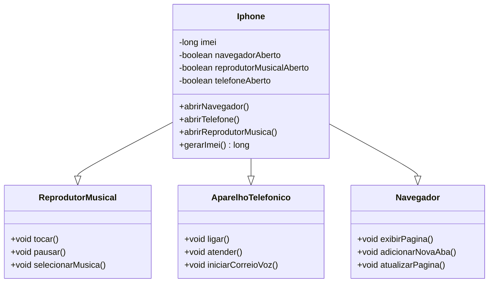

# Desafio-Iphone
 Desafio de ferramenta UML e Interfaces básicas

## UML Criada para este projeto :

## Resumo do Projeto

A Classe **Iphone** implementa as **interfaces** dos aplicativos mostrados e consome as funções em submenus criados separadamente para cada app.

Com isso o código gera Switch Cases diferentes para cada app e seleção de ações dentro do app. Deixando o usuário livre para sair e reutilizar todas as funcionalidades.
